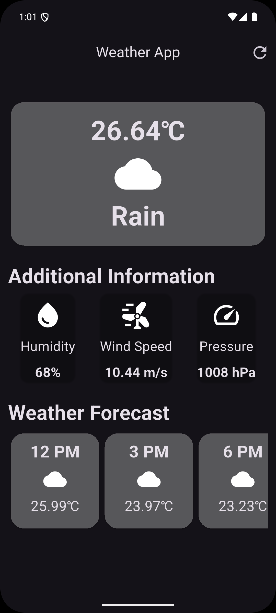

# 🌤️ Weather App

A clean, minimal weather forecast app built with **Flutter**, powered by the **OpenWeatherMap API**. Get current conditions and a 5-day / 3-hour forecast at a glance.

## Features

- 🌡️ Current temperature, sky condition, humidity, wind speed, and pressure
- 📅 Hourly forecast cards for the upcoming periods
- 🔄 Pull-to-refresh via the app bar refresh icon
- 🎨 Material 3 dark theme out of the box
- 📱 Cross-platform: Android, iOS, Web, Windows, macOS, and Linux (via Flutter)

## Screenshots

> 

## Tech Stack

- **Framework:** Flutter (Dart)
- **HTTP client:** [`http`](https://pub.dev/packages/http)
- **Date formatting:** [`intl`](https://pub.dev/packages/intl)
- **Weather data:** [OpenWeatherMap API](https://openweathermap.org/api) (5 Day / 3 Hour Forecast endpoint)

## Getting Started

### Prerequisites

- [Flutter SDK](https://docs.flutter.dev/get-started/install) (Dart SDK `^3.12.1` or compatible)
- An IDE (VS Code / Android Studio) with the Flutter & Dart plugins
- A free [OpenWeatherMap API key](https://home.openweathermap.org/users/sign_up)

### Installation

1. **Clone the repo**
   ```bash
   git clone https://github.com/RajwardhanZambare/Weather_App.git
   cd Weather_App
   ```

2. **Install dependencies**
   ```bash
   flutter pub get
   ```

3. **Add your API key**

   Open `lib/weather_screen.dart` and replace the `APPID` value in the API URL with your own OpenWeatherMap API key:
   ```dart
   final res = await http.get(Uri.parse(
     "https://api.openweathermap.org/data/2.5/forecast?q=$city&units=metric&APPID=YOUR_API_KEY_HERE"
   ));
   ```

   > 💡 For production projects, prefer passing the key at build time instead of hardcoding it, e.g.:
   > ```bash
   > flutter run --dart-define=OWM_API_KEY=your_key_here
   > ```
   > and reading it via `String.fromEnvironment('OWM_API_KEY')`.

4. **Run the app**
   ```bash
   flutter run
   ```

## Project Structure

```
lib/
├── main.dart                  # App entry point
├── weather_screen.dart        # Main screen: fetches & displays weather data
├── forecast_card.dart         # Widget for individual forecast slots
└── additional_information.dart # Widget for humidity/wind/pressure cards
```

## Configuration

By default, the app fetches weather for **Sangli**. To change the default city, update the `city` variable in `lib/weather_screen.dart`:

```dart
String city = "Sangli";
```

## Contributing

Contributions, issues, and feature requests are welcome. Feel free to open a pull request or file an issue.

## License

This project is open source and available for personal and educational use.